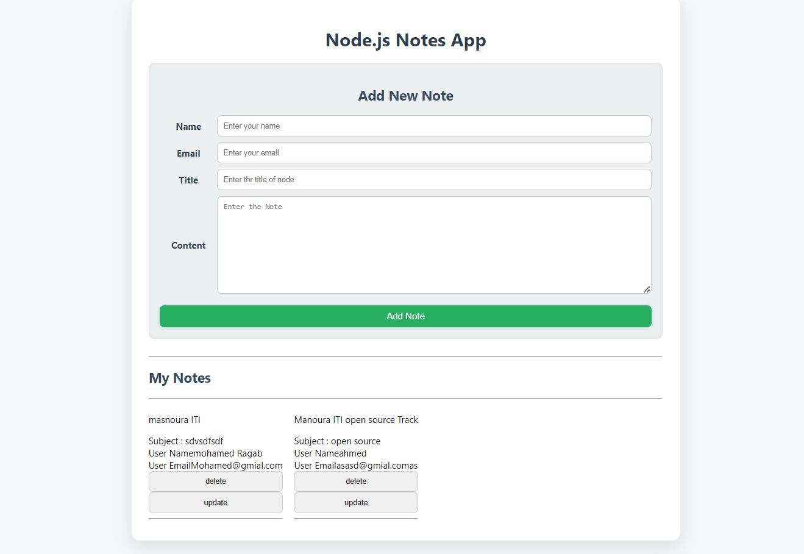

# 📝 simple-notes-api

A basic Notes REST API built using **pure Node.js** (no frameworks like Express). This project supports full CRUD operations and includes email validation, duplicate checks, and a simple frontend UI styled with CSS.

---

## 🚀 Features

- 🔧 Built using the Node.js `http` module
- 💾 Stores notes in a local `notes.json` file
- 🧪 **Email Validation**: Ensures a valid email format
- 🚫 **No Duplicate Emails**: Prevents adding multiple notes with the same email
- 💻 Basic frontend served at `/` using HTML + CSS
- 📁 Clean file structure

---

